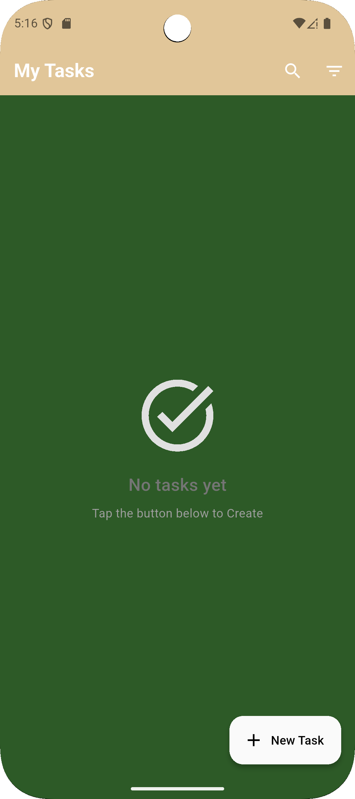
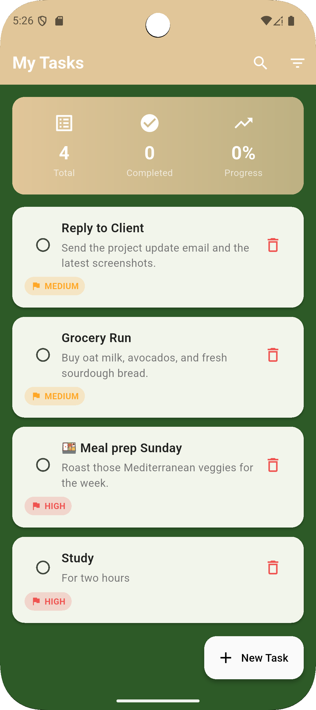
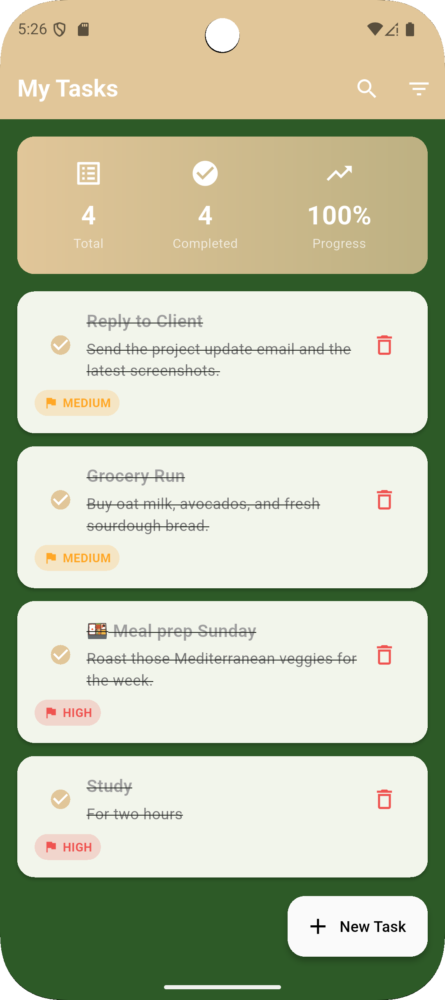

# Flutter Hive Todo App

A clean, beginner-friendly Todo application built with Flutter and Hive.

## Features
- Add, edit, delete todos
- Mark todos as completed
- Persistent local storage using Hive
- Clean Material UI
- Simple, readable architecture

## Tech Stack
- Flutter
- Dart
- Hive (local database)

## Folder Structure
- models → Hive data models
- services → Business logic & database access
- screens → UI pages
- widgets → Reusable UI components

## Setup
1. Clone the repo
2. Run `flutter pub get`
3. Generate Hive adapters:
   ```bash
   flutter pub run build_runner build

## App Preview

<p align="center">
  
  
  
  
  

</p>